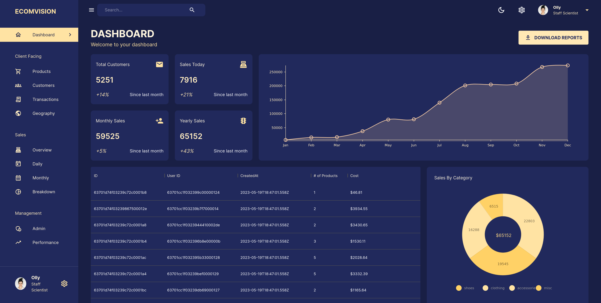

# admin-dashboard
Description: Admin dashboard using mock data built using the MERN stack (MongoDB, Express, React, Node)

**👇 Experience it yourself 👇**

https://admin-frontend-1v2e.onrender.com

***If the site has not been used in the last 15 minutes, it might take some time for the apis to load***

**Interesting things I've learned**
- Server side pagination
- Using MUI components
- Deployment on render.com

**Remaining optimisations**
- Vertical responsivity for menu
- Graph colors in light mode

